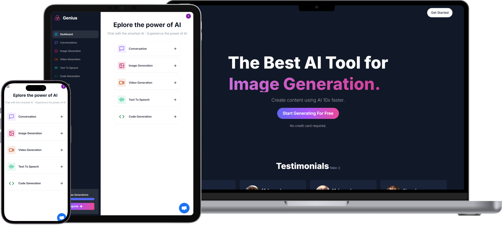
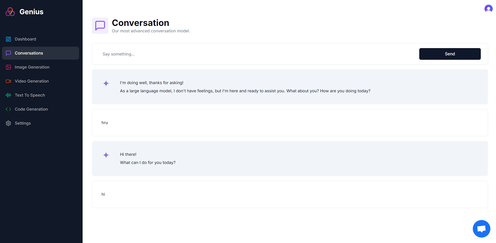
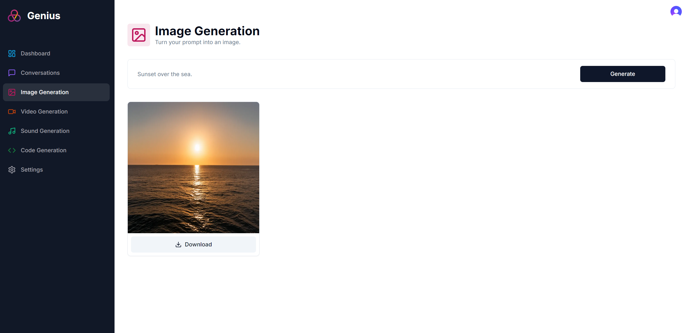
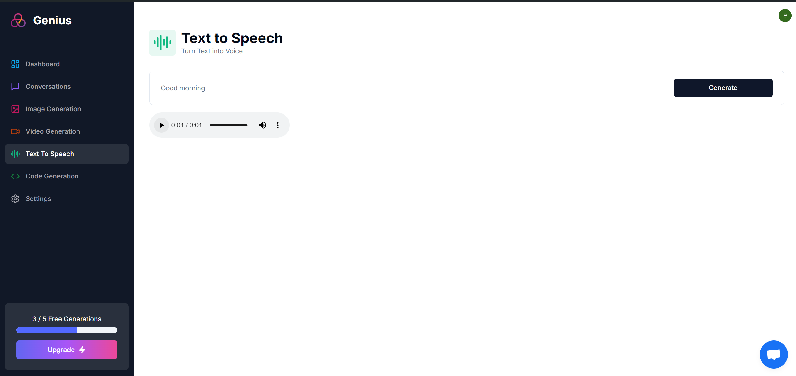
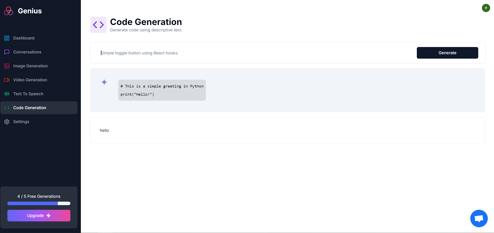
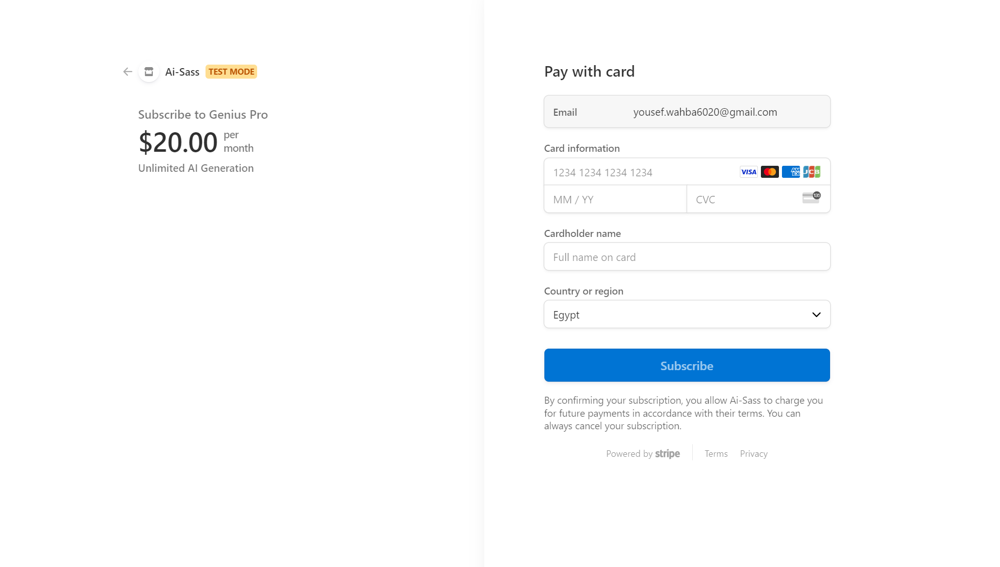
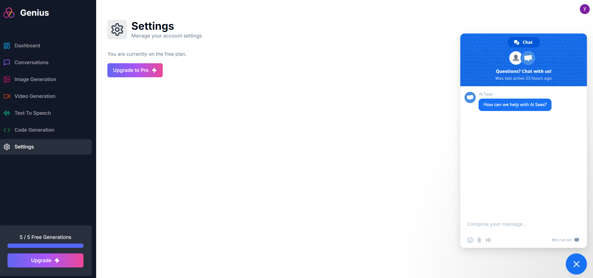

# AI-SaaS Platform

This platform provides advanced AI services, including chat, image, video, voice, and code generation, with integrated subscription management and customer support.



## Key Features

- **Chat**: AI-powered conversational capabilities.
  

- **Image & Video Generation**: Create high-quality visual content.
  

- **Voice Synthesis**: Convert text to natural-sounding speech.
  

- **Code Generation**: Automatically generate code snippets.
  
- **Subscription Management**: Seamlessly handle user subscriptions and payments.
  

- **Customer Support**: Built-in tools for customer assistance."i want to update each
  

## Getting Started

Configure environment variables and run the development server:

```bash
npm install
npm run dev
```

Open [http://localhost:3000](http://localhost:3000) with your browser to see the result.
